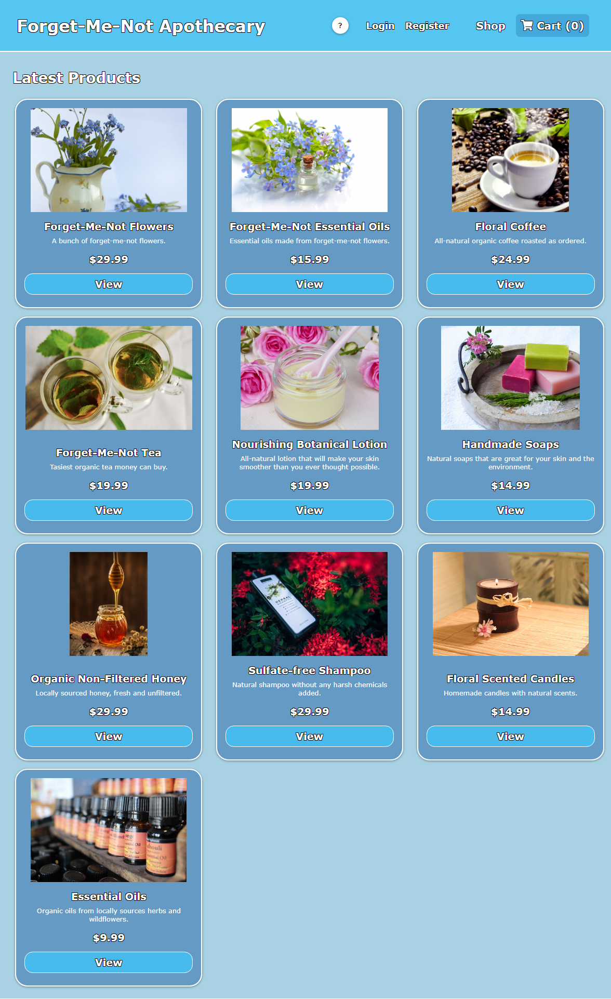

  <h3 align="center">Forget-Me-Not Apothecary - Server</h3>
    <p align="center">
<a href="https://github.com/PhilipBDev/Forget-Me-Not-Apothecary---Client">View Client Repository</a>
</p>

<p>
Due to the server running on a free tier of Heroku, please allow roughly 30 seconds for the website to display properly.
</p>

  <p align="center">
    <br />
    <a href="https://www.fmn-apothecary.store/">View Demo</a>
    ·
    <a href="https://github.com/PhilipBDev/Forget-Me-Not-Apothecary---Server/issues">Report Bug</a>
    ·
    <a href="https://github.com/PhilipBDev/Forget-Me-Not-Apothecary---Server/issues">Request Feature</a>
    </p>

<p align="center">
  <a href="https://www.fmn-apothecary.store">
    
  </a>
</p>

<!-- TABLE OF CONTENTS -->
<details open="open">
  <summary><h2 style="display: inline-block">Table of Contents</h2></summary>
  <ol>
    <li>
      <a href="#about-the-project">About The Project</a>
      <ul>
        <li><a href="#built-with">Built With</a></li>
      </ul>
    </li>
    <li>
      <a href="#getting-started">Getting Started</a>
      <ul>
        <li><a href="#installation">Installation</a></li>
      </ul>
    </li>
    <li><a href="#roadmap">Roadmap</a></li>
    <li><a href="#license">License</a></li>
    <li><a href="#contact">Contact</a></li>
    <li><a href="#resources">Resources</a></li>
  </ol>
</details>

<!-- ABOUT THE PROJECT -->

## About The Project

This fullstack application features a functional store environment that allows you to create an account and place an order through PayPal Sandbox.

Users can add items to cart, adjust the cart as needed (which automatically updates the subtotal), go through the mock PayPal process, and upon completion of the order they will be directed to an order confirmed page that will automatically redirect the user back to the home page.

The user system is in place to see if I could make all prices discounted upon logging in to mimic a membership-oriented store. All prices get set to 10% lower (plus 1 cent to make it nicer to look at) upon registration or logging in.

Trying to figure out how to connect Redux and Paypal Sandbox together was the most challenging part since I knew nothing about them going in. To be honest, I'd need a refresher if I were to use Redux again, but I've got the gist of it so it'll be much easier to figure out next time. Another issue I faced was figuring out how to make the front end talk to the back end from Netlify to Heroku, which involved purchasing a domain name and routing both through Cloudflare.

### Built With

- [React](https://reactjs.org/)
- [Node](https://nodejs.org/en/)
- [Express](https://expressjs.com/)
- [MongoDB](https://www.mongodb.com/)

- [Redux](https://react-redux.js.org/)
- [PayPal Sandbox](https://developer.paypal.com/)
- [Styled-Components](https://styled-components.com/)

<!-- GETTING STARTED -->

## Getting Started

To get a local copy up and running follow these simple steps.

### Installation

1. Clone the repo
   ```sh
   git clone https://github.com/PhilipBDev/Forget-Me-Not-Apothecary---Server.git
   ```
2. Install NPM packages
   ```sh
   npm install
   ```
3. Create an ENV file with the following attributes using your own keys from MongoDB Atlas, PayPal Sandbox, and your own JWT Secret string:

   ```sh
    PORT=5000
    MDB_CONNECT_STRING=
    JWT_SECRET=
    PAYPAL=
   ```

<!-- ROADMAP -->

## Roadmap

See the [open issues](https://github.com/PhilipBDev/Forget-Me-Not-Apothecary---Server/issues) for a list of proposed features (and known issues).

<!-- LICENSE -->

## License

Distributed under the MIT License. See `LICENSE` for more information.

<!-- CONTACT -->

## Contact

Your Name - [@PhilipBDev](https://twitter.com/PhilipBDev) - PhilipBDev@gmail.com

Project Link: [https://github.com/PhilipBDev/Forget-Me-Not-Apothecary---Server](https://github.com/PhilipBDev/Forget-Me-Not-Apothecary---Server)

<!-- RESOURCES -->

## Resources

- [Netlify](https://www.netlify.com/)
- [Heroku](https://www.heroku.com/)
- [Cloudflare](https://www.cloudflare.com/)
- [Namecheap](https://www.namecheap.com/)
